# Strata

A modern Quantitative Finance Dashboard built with **FastAPI** (Python) and **React** (TypeScript).

## Project Overview

This application provides a comprehensive suite of tools for quantitative analysis, including:

*   **Global Financial News**: Real-time aggregation of global market news.
*   **Market Analysis**: Advanced technical charting with overlay indicators (SMA, EMA, RSI, MACD).
*   **Pairs Trading Strategy**: Statistical Arbitrage engine finding cointegrated pairs across a 50+ ticker universe.
*   **Monte Carlo Simulation**: Geometric Brownian Motion (GBM) engine accelerated by C++ for risk analysis.
*   **Notification Center**: Real-time system alerts, strategy signals, and risk warnings.

## Project Structure

```
quant-platform/
├── backend/                 # Python FastAPI backend
│   ├── app/
│   │   ├── api/            # API endpoints (v1)
│   │   ├── core/           # Configuration
│   │   ├── engine/         # C++ Extension modules
│   │   ├── models/         # SQLModel database schemas
│   │   ├── services/       # Business logic (News, Simulation, Cointegration)
│   │   └── main.py         # Application entry point
│   ├── scripts/            # Data seeding and build scripts
│   └── requirements.txt    # Python dependencies
├── frontend/                # React Vite frontend
│   ├── src/
│   │   ├── components/     # Reusable UI components (Shadcn/UI)
│   │   ├── pages/          # Application views
│   │   ├── services/       # API client modules
│   │   └── App.tsx         # Root component
│   └── package.json        # Node dependencies
└── data/                    # SQLite database storage
```

## Quick Start

### Prerequisites

*   **Python** 3.10+
*   **Node.js** 18+
*   **C++ Compiler** (Visual Studio Build Tools for Windows) for the Monte Carlo engine

### Backend Setup

1.  Navigate to the backend directory:
    ```bash
    cd backend
    ```

2.  Create and activate virtual environment:
    ```bash
    # Windows
    python -m venv venv
    .\venv\Scripts\activate
    ```

3.  Install dependencies:
    ```bash
    pip install -r requirements.txt
    ```

4.  Build C++ Extension (Required for Monte Carlo):
    ```bash
    python scripts/build_extension.py
    ```

5.  Initialize Database and Seed Market Data:
    ```bash
    # Seeds ~50 tickers with historical data
    python -m scripts.seed_market_data
    ```

6.  Run the server:
    ```bash
    python -m app.main
    ```
    API will run at `http://localhost:8000`.

### Frontend Setup

1.  Navigate to the frontend directory:
    ```bash
    cd frontend
    ```

2.  Install dependencies:
    ```bash
    npm install
    ```

3.  Run development server:
    ```bash
    npm run dev
    ```
    Application will run at `http://localhost:5173`.

## Features in Detail

### Dashboard
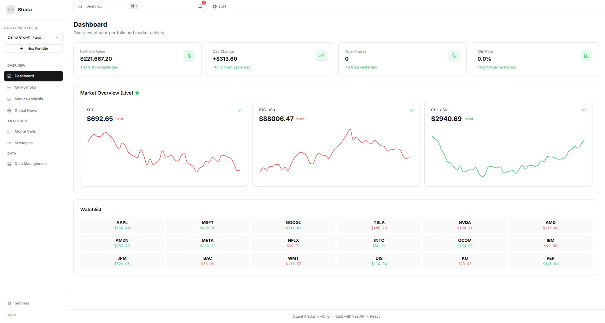
Overview of market metrics and quick access to key features.

### Global News
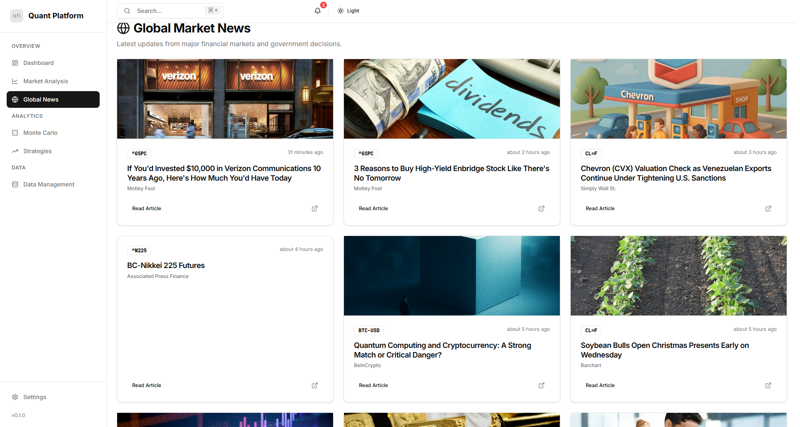
Aggregates financial news from multiple global sources using `yfinance`. Displays articles in a responsive grid with source attribution and timestamps.

### Market Analysis
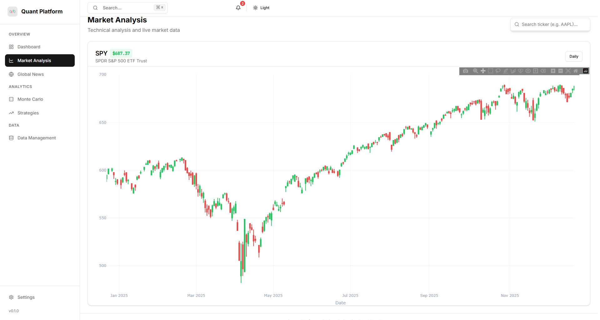
Advanced technical charting with overlay indicators (SMA, EMA, RSI, MACD).

### Pairs Trading
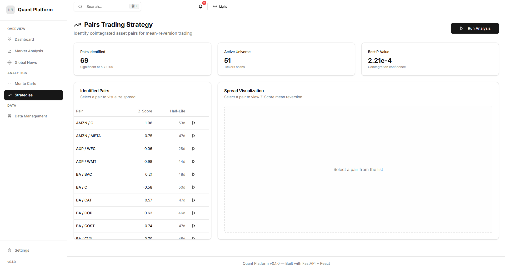
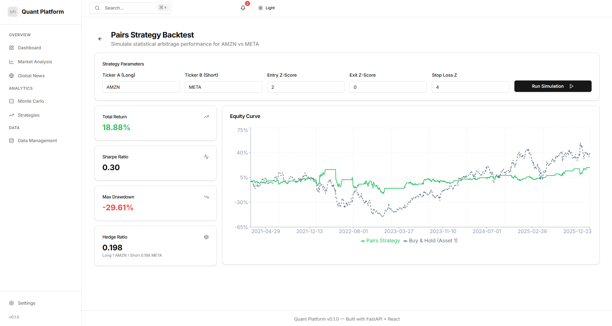
Identifies pairs of assets that move together (cointegration).
*   **Universe**: Scans 50+ tickers across Tech, Finance, Energy, and Healthcare.
*   **Metrics**: Calculates Hedge Ratio, Half-Life, and current Z-Score.
*   **Signals**: Highlights pairs with statistical significance (p-value < 0.05).

### Monte Carlo Simulation
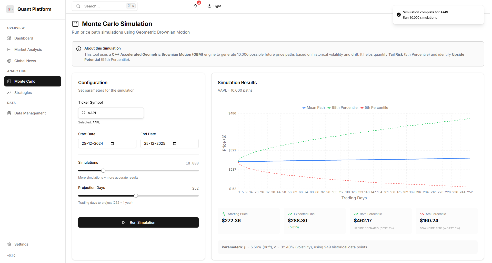
Proprietary C++ engine for high-performance price path simulation.
*   **Model**: Geometric Brownian Motion (GBM).
*   **Inputs**: Historical Volatility over 1 year.
*   **Outputs**: 10,000+ simulations to estimate 5th percentile (Risk) and 95th percentile (Upside).
*   **Tail Risk Metrics**: Value at Risk (VaR) and Conditional VaR (CVaR) at 95% confidence.

### Options Analysis
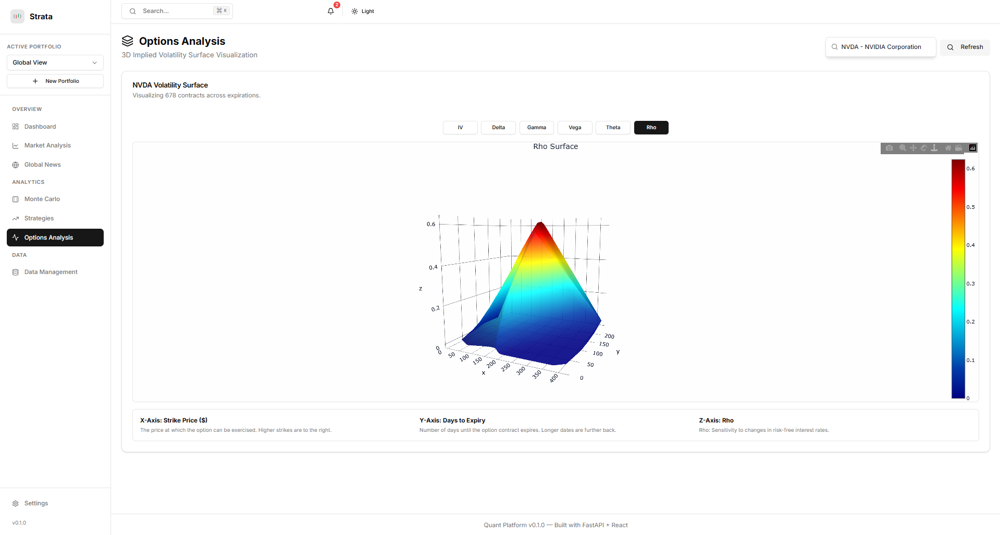
Advanced 3D visualization of Options Implied Volatility and Greeks.
*   **3D Volatility Surface**: Interactive 3D mesh visualizing Implied Volatility across Strike Price and Days to Expiry.
*   **Greeks Visualization**: Togglable 3D views for Delta, Gamma, Vega, Theta, and Rho.
*   **Smart Search**: Integrated ticker search with autocomplete.
*   **High-Performance Engine**: Black-Scholes Greeks calculated via C++ extension for sub-millisecond latency.

### Portfolio Management
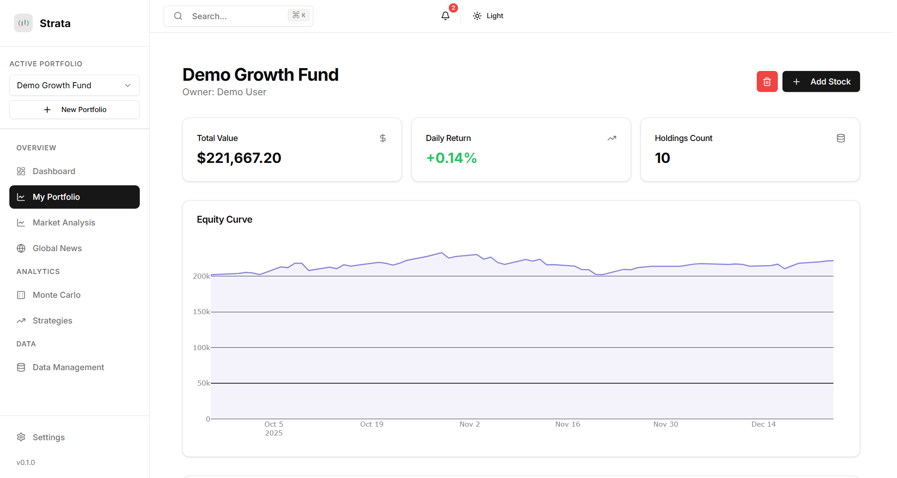
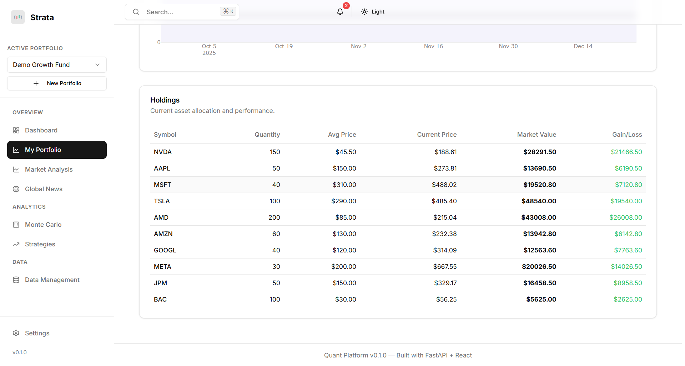
Comprehensive portfolio tracking and performance analysis.
*   **Performance Metrics**: Real-time tracking of Total Value, Daily Return, and Equity Curve using historical data.
*   **Holdings Management**: Add specific positions with intelligent "Smart Search" for tickers.
*   **Multi-Portfolio Support**: Create, manage, and delete multiple distinct portfolios.
*   **Smart News Filtering**: Filter global news based on the holdings of your specific portfolio.

### Data Management
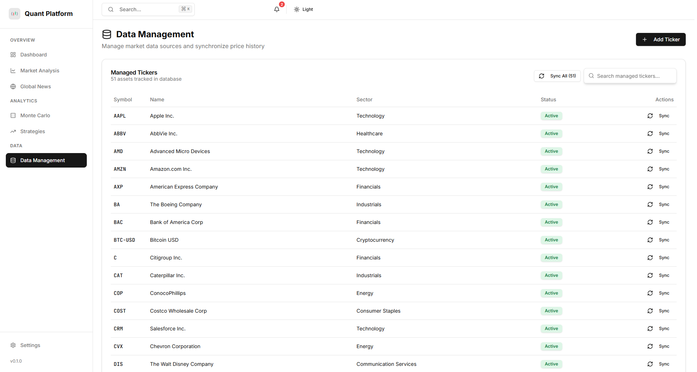
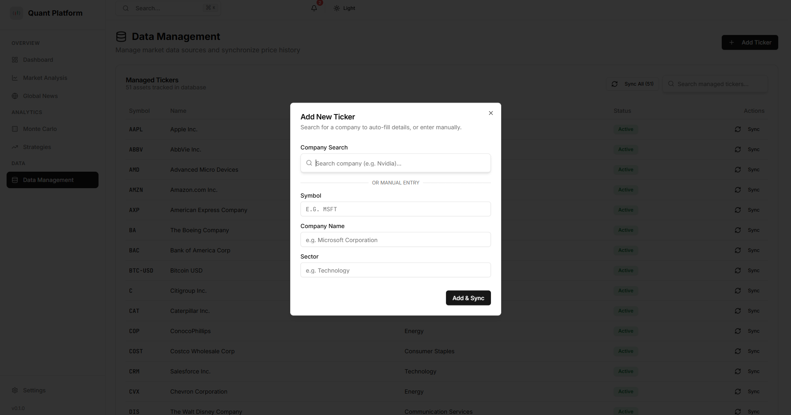
Manage your portfolio universe, add new tickers via intelligent search, and sync historical data.

### Notification Center
Centralized hub for application alerts.
*   **System**: Data sync status.
*   **Strategy**: New trading signals.
*   **Risk**: Volatility warnings.

### Settings
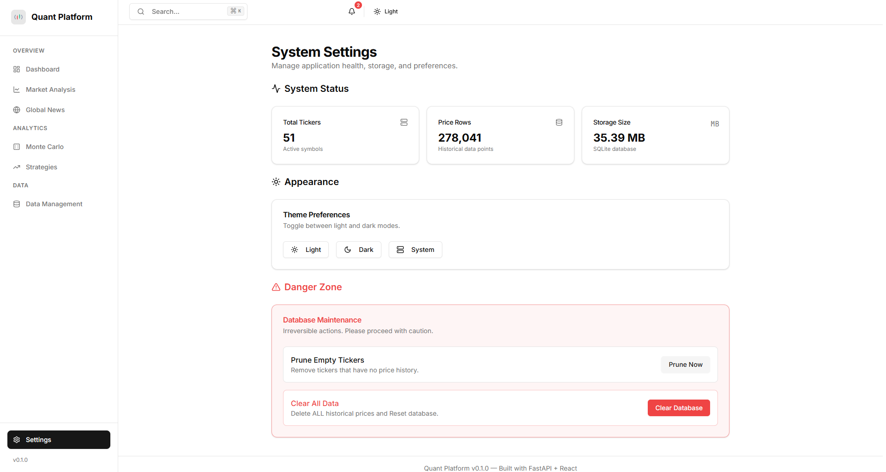
Configure application preferences and themes.

## Tech Stack

### Backend
*   **FastAPI**: High-performance web framework.
*   **SQLModel**: Database ORM.
*   **NumPy / Pandas**: Quantitative analysis.
*   **Pybind11**: C++ integration.

### Frontend
*   **React 18**: UI Library.
*   **Vite**: Build tool.
*   **Shadcn/UI**: Component library.
*   **Recharts**: Data visualization.
*   **TanStack Query**: Data fetching.

